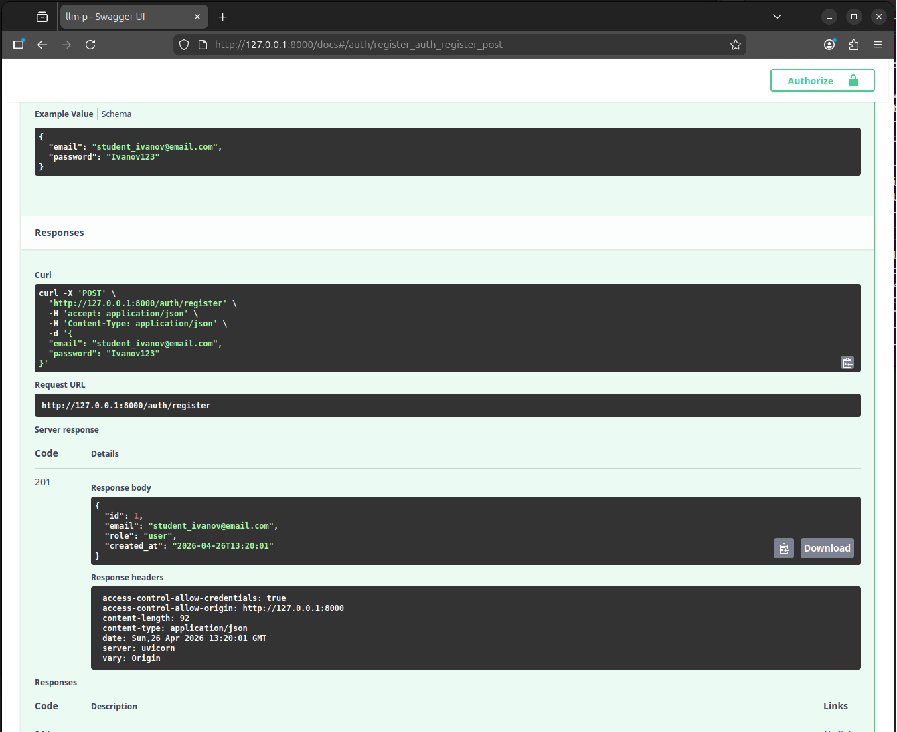
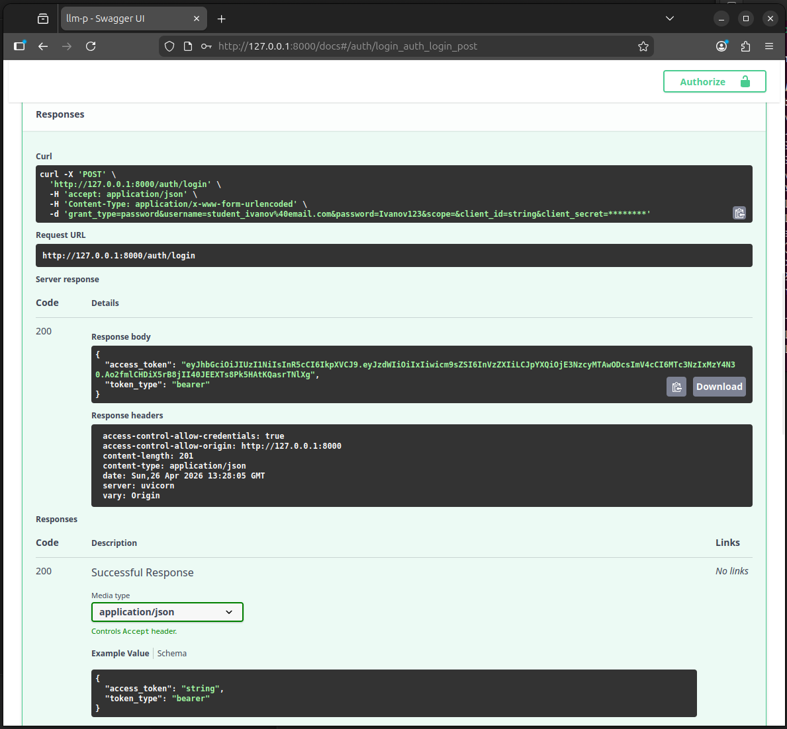
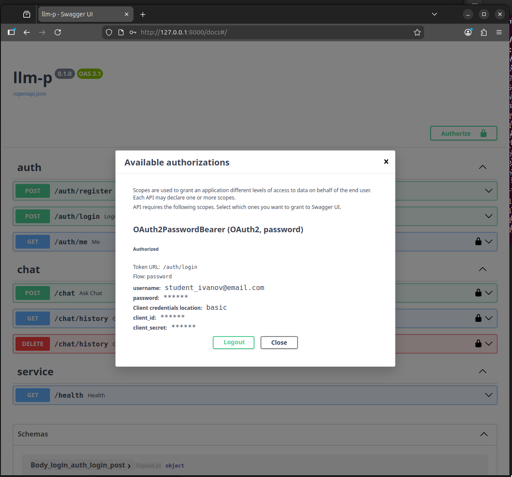
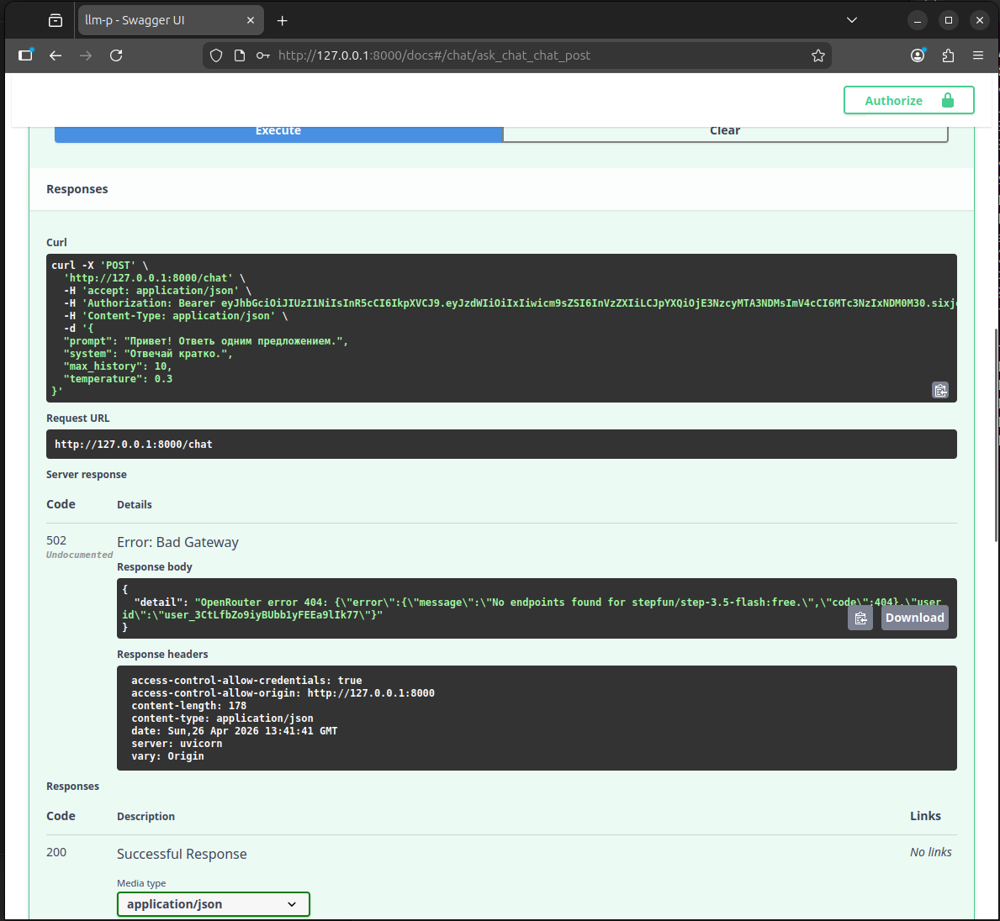
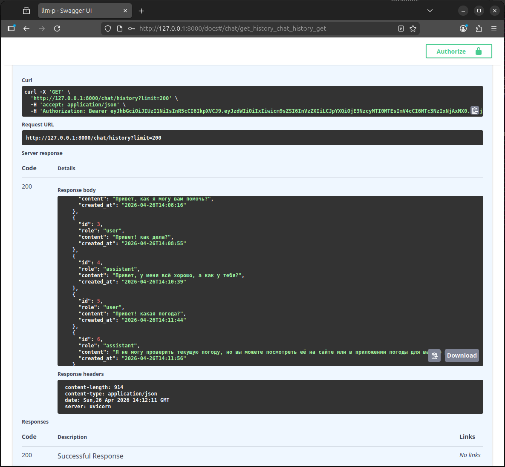
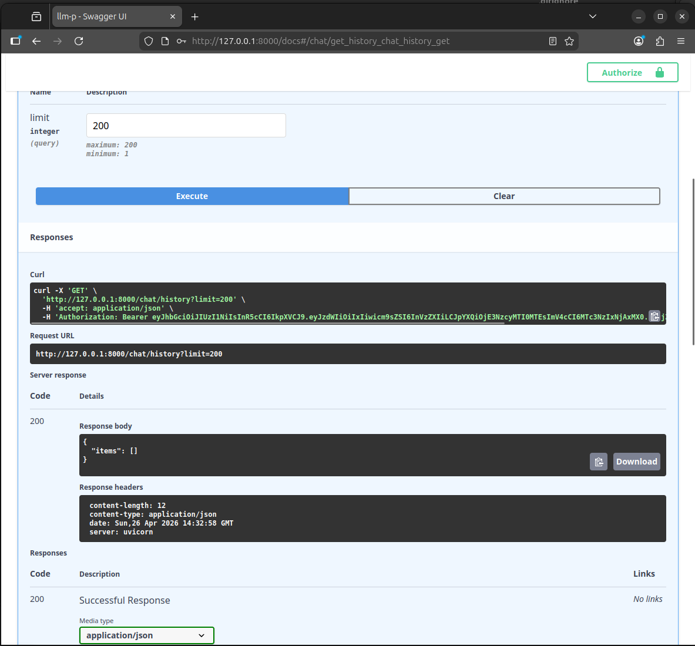

# llm-p

FastAPI-сервис с JWT-аутентификацией, SQLite, историей чата и проксированием запросов к LLM через OpenRouter.

## Стек
- FastAPI
- SQLAlchemy 2.0 + aiosqlite
- JWT (python-jose)
- passlib + bcrypt
- OpenRouter API
- uv для управления проектом и зависимостями

## Структура проекта

```text
llm-p/
├── pyproject.toml
├── README.md
├── .env.example
├── app/
│   ├── __init__.py
│   ├── main.py
│   ├── core/
│   │   ├── __init__.py
│   │   ├── config.py
│   │   ├── errors.py
│   │   └── security.py
│   ├── db/
│   │   ├── __init__.py
│   │   ├── base.py
│   │   ├── models.py
│   │   └── session.py
│   ├── schemas/
│   │   ├── __init__.py
│   │   ├── auth.py
│   │   ├── chat.py
│   │   └── user.py
│   ├── repositories/
│   │   ├── __init__.py
│   │   ├── chat_messages.py
│   │   └── users.py
│   ├── services/
│   │   ├── __init__.py
│   │   └── openrouter_client.py
│   ├── usecases/
│   │   ├── __init__.py
│   │   ├── auth.py
│   │   └── chat.py
│   └── api/
│       ├── __init__.py
│       ├── deps.py
│       ├── routes_auth.py
│       └── routes_chat.py
└── app.db
```

## Установка через uv

### 1. Установить uv
```bash
pip install uv
```

### 2. Инициализировать проект
```bash
uv init
```

### 3. Создать виртуальное окружение
```bash
uv venv
```

### 4. Активировать виртуальное окружение
```bash
source .venv/bin/activate
# Windows:
# .venv\Scripts\activate.bat
```

### 5. Установить зависимости
```bash
uv pip install -r <(uv pip compile pyproject.toml)
```

## Настройка `.env`

Скопируйте пример:
```bash
cp .env.example .env
```

Заполните `OPENROUTER_API_KEY` своим ключом OpenRouter.

Пример:
```env
APP_NAME=llm-p
ENV=local
JWT_SECRET=change_me_super_secret
JWT_ALG=HS256
ACCESS_TOKEN_EXPIRE_MINUTES=60
SQLITE_PATH=./app.db
OPENROUTER_API_KEY=your_key_here
OPENROUTER_BASE_URL=https://openrouter.ai/api/v1
OPENROUTER_MODEL=nvidia/nemotron-3-super-120b-a12b:free
OPENROUTER_SITE_URL=https://example.com
OPENROUTER_APP_NAME=llm-fastapi-openrouter
```
```
Response body

{
  "detail": "OpenRouter error 404: {\"error\":{\"message\":\"No endpoints found for stepfun/step-3.5-flash:free.\",\"code\":404},\"user_id\":\"user_3CtLfbZo9iyBUbb1yFEEa9lIk77\"}"
}

Response headers

 access-control-allow-credentials: true 
 access-control-allow-origin: http://127.0.0.1:8000 
 content-length: 178 
 content-type: application/json 
 date: Sun,26 Apr 2026 13:48:29 GMT 
 server: uvicorn 
 vary: Origin
 ```
 
Я не понял, почему это произошло, и поэтому поменял модель на другую.

Для соответствия ТЗ в проекте должна используется модель:

```env
OPENROUTER_MODEL=stepfun/step-3.5-flash:free
```

## Запуск приложения

```bash
uv run uvicorn app.main:app --reload --host 0.0.0.0 --port 8000
```

Swagger доступен по адресу:
- `http://127.0.0.1:8000/docs`

## Эндпоинты

### Auth
- `POST /auth/register` — регистрация пользователя
- `POST /auth/login` — логин и получение JWT
- `GET /auth/me` — профиль текущего пользователя

### Chat
- `POST /chat` — отправить запрос к LLM
- `GET /chat/history` — получить историю чата текущего пользователя
- `DELETE /chat/history` — очистить историю текущего пользователя

### Service
- `GET /health` — проверить работоспособность сервиса

## Проверка качества кода

```bash
ruff check
```

Ожидаемый результат:
```text
All checks passed!
```

## Демонстрация работы

Ниже приведены скриншоты работы всех обязательных эндпоинтов. Для регистрации используется email формата `student_surname@email.com`:

```text
student_ivanov@email.com
```

### 1. Регистрация


### 2. Логин и получение JWT


### 3. Авторизация через Swagger


### 4. Успешный вызов POST `/chat`


### 5. Получение истории GET `/chat/history`


### 6. Очистка истории DELETE `/chat/history`


### 7. Проверка, что история очищена GET `/chat/history`


## Что проверено
- регистрация пользователя с сохранением email и хешированного пароля
- логин пользователя с выдачей JWT access token
- авторизация через кнопку `Authorize` в Swagger
- запрос к LLM через `POST /chat`
- сохранение истории чата в SQLite
- получение истории текущего пользователя через `GET /chat/history`
- очистка истории текущего пользователя через `DELETE /chat/history`
- проверка стиля кода через `ruff check`
